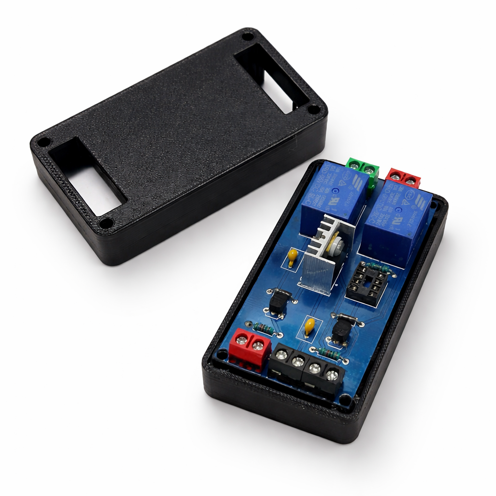
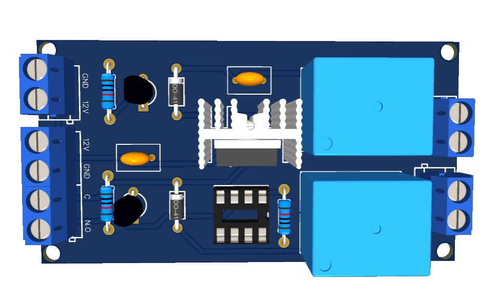

# Custom Control PCB

Built for a construction company. Safety monitoring system for disability residence bathrooms — PIR-triggered voice communication via custom PCB with 3D-printed enclosure.

 

---

## Overview

A custom-designed PCB control circuit built for a construction company The system monitors bathroom occupancy in disability residences using a PIR sensor. When motion is detected, it activates a microphone and speaker via relay control, enabling two-way voice communication for emergency response.

Full project ownership: schematic design, PCB layout, BOM selection, component sourcing, and custom enclosure design and 3D printing.

---



## Features

- ✅ PIR motion/occupancy detection
- ✅ Relay-controlled microphone and speaker activation
- ✅ Complete on-board control logic (no external MCU required)
- ✅ Custom 3D-printed enclosure for field deployment
- ✅ Designed for reliability and real-world installation

---

---

## Microcontroller — ATtiny85

The ATtiny85 was chosen as the brain of this circuit for three reasons:

- **Low power consumption** — the system runs continuously in bathrooms; minimal power draw was essential
- **Small footprint** — the compact 8-DIP package kept the PCB size small for easy enclosure integration
- **Cost-effective** — for a deployed safety product, component cost matters; ATtiny85 delivers reliable performance at a low unit price

The control logic (PIR detection → relay switching) is simple enough that a full Arduino or ESP32 would be overkill. ATtiny85 handles it perfectly with room to spare.

| Spec | Value |
|---|---|
| MCU | ATtiny85 |
| Package | 8-DIP |
| Operating Voltage | 2.7V – 5.5V |
| Flash | 8KB |
| I/O Pins | 6 |

## Hardware Design

| Element | Details |
|---|---|
| PCB Tool | KiCAD / EasyEDA |
| Power Input | 12V DC |
| Sensor | PIR (passive infrared) |
| Output | Relay × 2 (microphone + speaker) |
| Enclosure | Custom 3D-printed |

---


## Project Scope

| Phase | Deliverable |
|---|---|
| Schematic | Full circuit design in KiCAD |
| PCB Layout | Routed board with DRC clearance |
| BOM | Component selection and sourcing |
| Fabrication | Gerber files sent to manufacturer |
| Enclosure | SolidWorks design → 3D printed |
| Deployment | Installed at client site |

---

## System Logic

```
PIR Sensor detects motion
        ↓
Relay 1 closes → Microphone activated
Relay 2 closes → Speaker activated
        ↓
Two-way voice communication enabled
        ↓
Staff notified of potential emergency
```


